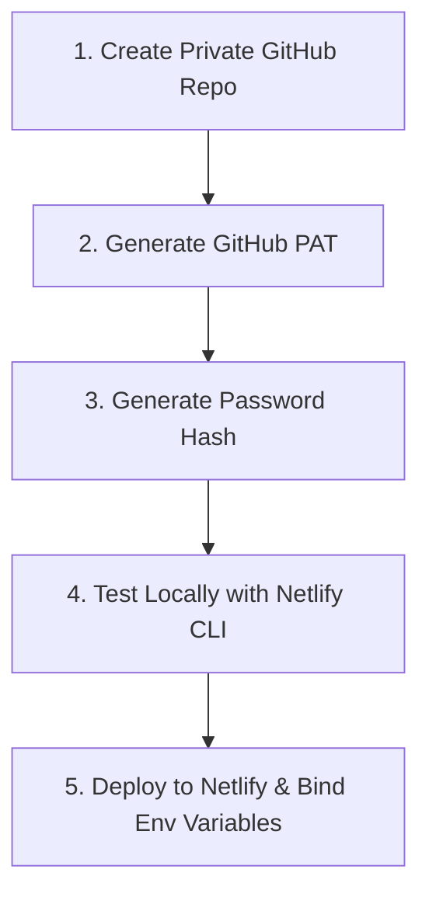

# Cloud Mint — Setup & Deployment Guide 🍃

This guide provides step-by-step instructions to configure, run locally, and deploy **Cloud Mint** to Netlify with a secure, private GitHub repository as your backend storage.

---

## Setup Workflow



---

## Step 1: Create a Private GitHub Repository

1. Log in to your [GitHub Account](https://github.com).
2. Create a new repository:
   - **Repository Name:** e.g., `my-private-vault`
   - **Visibility:** Select **Private** (recommended for personal file security).
   - **Initialize:** You can leave it empty, or add a README. (Cloud Mint is engineered to automatically initialize empty repositories on your first upload!).

---

## Step 2: Generate a GitHub Personal Access Token (PAT)

Cloud Mint requires a Personal Access Token to write and delete files directly in your repository.

1. Navigate to **GitHub Settings > Developer Settings > Personal Access Tokens**.
2. Select **Tokens (classic)** (recommended for simple setups) or **Fine-grained tokens**.
3. **For Classic Tokens:**
   - Click **Generate new token (classic)**.
   - Give it a descriptive note: `Cloud Mint File Manager`.
   - Select the **`repo`** scope (covers all sub-scopes for reading/writing private repositories).
   - Click **Generate token** and copy the resulting string (`ghp_...`).
4. **For Fine-grained Tokens:**
   - Click **Generate new token**.
   - Under **Repository access**, select **Only select repositories** and pick your vault repository.
   - Under **Permissions**, grant **Read and Write** access to **Contents**.
   - Generate and copy the token.

> [!CAUTION]
> Copy and save your PAT immediately. GitHub will not show it to you again. Never share this token or commit it directly to your code repository.

---

## Step 3: Hash your Master Password

To secure the proxy function, you must pre-hash your access password. The proxy function will verify it against the hashed signature using timing-safe comparisons.

Choose one of the methods below to hash your chosen password (e.g., `my-secure-password`):

### Option A: Using OpenSSL (macOS/Linux/Git Bash)
```bash
echo -n "my-secure-password" | openssl dgst -sha256
# Output: a665a45920422f9d417e4867efdc4fb8a04a1f3fff1fa07e998e86f7f7a27ae3
```

### Option B: Using PowerShell (Windows)
```powershell
$bytes = [System.Text.Encoding]::UTF8.GetBytes("my-secure-password")
$hash = [System.Security.Cryptography.SHA256Managed]::new().ComputeHash($bytes)
[System.BitConverter]::ToString($hash).Replace("-", "").ToLower()
# Output: a665a45920422f9d417e4867efdc4fb8a04a1f3fff1fa07e998e86f7f7a27ae3
```

### Option C: Using Node.js
```bash
node -e "console.log(require('crypto').createHash('sha256').update('my-secure-password').digest('hex'))"
# Output: a665a45920422f9d417e4867efdc4fb8a04a1f3fff1fa07e998e86f7f7a27ae3
```

Keep this 64-character hex string handy.

---

## Step 4: Test Locally with Netlify CLI

Before deploying live, you can run and test Cloud Mint locally:

1. Clone or copy the project files to a local directory.
2. Install the Netlify CLI globally if you haven't already:
   ```bash
   npm install -g netlify-cli
   ```
3. In the root of the project, create a file named `.env` and fill it with your credentials:
   ```env
   MINT_HASHED_PASSWORD=a665a45920422f9d417e4867efdc4fb8a04a1f3fff1fa07e998e86f7f7a27ae3
   MINT_GITHUB_PAT=ghp_YourPersonalAccessTokenHere
   MINT_GITHUB_OWNER=your-github-username
   MINT_GITHUB_REPO=my-private-vault
   MINT_GITHUB_BRANCH=main
   ```
4. Run the local dev server:
   ```bash
   netlify dev
   ```
5. Open `http://localhost:8888` in your browser. Enter your plaintext password (`my-secure-password`) to test logging in, uploading, creating folders, and deleting files.

---

## Step 5: Deploy to Netlify

### Option A: Deploy via GitHub Git Integration (Recommended)
1. Push your Cloud Mint codebase (containing `netlify.toml`, `package.json`, `public/`, and `netlify/`) to a **private** repository on GitHub (separate from your storage repository!).
2. Log in to [Netlify](https://www.netlify.com).
3. Click **Add new site > Import an existing project**.
4. Link your GitHub account and select your Cloud Mint codebase repository.
5. Netlify will auto-detect settings from `netlify.toml`. Click **Deploy**.

### Option B: Deploy via Netlify CLI Manual Deployment
If you prefer not to host the code itself on GitHub, you can deploy directly from your command line:
1. Initialize the Netlify site:
   ```bash
   netlify init
   ```
2. Deploy production build:
   ```bash
   netlify deploy --prod
   ```

---

## Step 6: Configure Netlify Environment Variables

Once your site is deployed, bind your secrets:

1. In the Netlify Dashboard, navigate to your site.
2. Go to **Site Configuration > Environment variables**.
3. Click **Add a variable** and configure the variables:
   - `MINT_HASHED_PASSWORD` (64-character SHA-256 hex signature or a bcrypt hash of your master password)
   - `MINT_GITHUB_PAT` (GitHub Personal Access Token with `repo` scope or fine-grained `Contents` read/write access)
   - `MINT_GITHUB_OWNER` (*Optional* — Your GitHub Username. If left blank, you will be prompted for it on the login page.)
   - `MINT_GITHUB_REPO` (*Optional* — Your Private Vault Repository Name. If left blank, you will be prompted for it on the login page.)
   - `MINT_GITHUB_BRANCH` (*Optional* — Target branch, defaults to `main`. If owner/repo are blank, you can also customize this on the login page.)
4. Trigger a new deploy or wait for Netlify to propagate the environment variables (typically takes a few seconds).
5. Open your live Netlify site URL, unlock your vault, and enjoy your personal private file manager!

> [!TIP]
> **Dynamic Repository Connection:** By leaving `MINT_GITHUB_OWNER` and `MINT_GITHUB_REPO` unconfigured in Netlify, your Cloud Mint instance acts as a flexible client. The UI will automatically display repository and branch input fields, allowing you to log into different repositories and branches dynamically using the same deployment.
