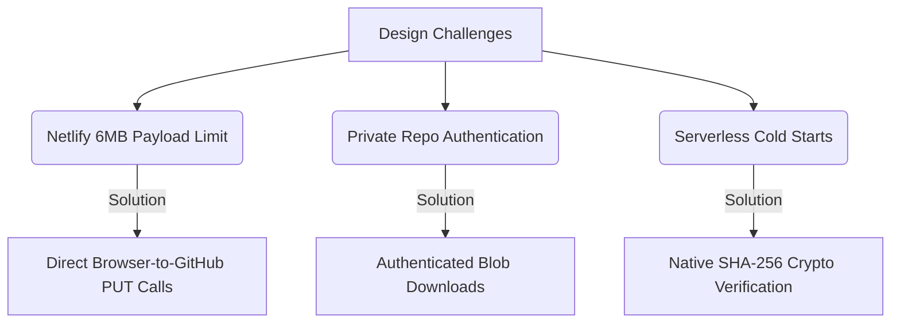

# Cloud Mint — Agentic Architecture & Design Log 🤖🍃

This document outlines the architectural decisions, design philosophies, and implementation patterns utilized during the collaborative development of **Cloud Mint** by the developer (USER) and the AI agent (**Antigravity**).

---

## Agentic Architectural Decisions

During the development of Cloud Mint, several critical engineering choices were made to optimize security, responsiveness, and performance within serverless constraints:

### 1. Direct Client-to-GitHub Operations (Netlify Payload Bypassing)
- **Problem:** Netlify Serverless Functions have a strict **6MB** request payload ceiling. Routing file uploads through a serverless function proxy would trigger crashes for files larger than 6MB.
- **Solution:** We designed the Netlify function to act strictly as a gatekeeper for authentication. Upon successful key validation, it returns the GitHub Personal Access Token (PAT) to the client. All file creations, list tree fetches, and deletions stream directly from the browser's JavaScript engine to the GitHub REST API (`api.github.com`).

### 2. Client-Side Size Capping (25MB Safety Ceiling)
- **Problem:** Base64-encoding extremely large files in single-threaded browser JS can freeze the window, and large HTTP payloads risk API timeouts or connection drops.
- **Solution:** Instantly intercept file selection in the DOM using `File.size`. If the file exceeds `25MB` (26,214,400 bytes), the upload is aborted, and a sleek, modal error panel is rendered, maintaining application responsiveness.

### 3. Authenticated Blob Downloads
- **Problem:** A private repository's file download URL (`raw.githubusercontent.com/...`) returns a `404 Not Found` if accessed in a standard browser tab via `window.open`, as it lacks authorization.
- **Solution:** We implemented an in-memory authenticated download engine. The client issues a `fetch` request to the GitHub Contents API with the custom `Accept: application/vnd.github.v3.raw` header and the authorization bearer token. The response is converted into a native browser Blob and trigger-clicked using a temporary `<a>` element. This guarantees secure downloads without exposing the raw URL.

### 4. Native SHA-256 Password Cryptography
- **Problem:** Installing heavy encryption libraries (like native C++ `bcrypt`) in serverless functions often triggers deployment failures due to architecture compilation mismatch, and adds package bloat.
- **Solution:** The authentication function defaults to Node's native `crypto` module to perform **SHA-256** hash comparisons. It uses `crypto.timingSafeEqual` to avoid timing side-channel attacks. A pure-JS fallback for `bcryptjs` is included if the environment variable hash matches a bcrypt pattern, keeping the deployment light and robust.

### 5. Local Path Trie/Tree Parsing
- **Problem:** Making multiple API calls to traverse folders is slow and exhausts the GitHub API rate limit (5,000 requests/hour for authenticated users).
- **Solution:** On initial load or refresh, Cloud Mint queries the **Git Trees API** with `recursive=true`. It fetches the entire repository structure in a single API call, parses the flat array into a hierarchical Trie structure (`FileNode` class) in browser RAM, and handles all navigation and searching locally.

---

## UI/UX Design System Choices

- **Contrast & Depth:** We selected an ultra-deep canvas (`bg-slate-950`) combined with backdrop-blurred cards (`backdrop-blur-md bg-slate-900/40`) to create a modern glassmorphic interface that feels like a premium desktop app.
- **Emerald Mint Accents:** Accent lines, icons, and buttons utilize Emerald Mint (`text-emerald-400`, `bg-emerald-500/10`) to provide high contrast against the dark base.
- **Touch Targets:** Rows feature large vertical target padding (`py-5 px-6`), making them extremely accessible on mobile screens.
- **Gesture Interactions:** Mobile users can long-press a row (supported by custom mousedown/touchstart timer bounds) or tap the explicit ellipsis (`...`) button to trigger a slide-up action sheet, while desktop users see actions on mouse-hover.

---

## Agent Collaboration Patterns

The implementation was constructed in a structured pair-programming flow:
1. **Plan Formulation:** We created [project_plan.md](file:///D:/DEV/Cloud%20Mint/project_plan.md) mapping out all endpoints, states, and limit requirements to align on the technical specifications.
2. **Proxy Gateway Build:** Wrote and optimized the lightweight Netlify serverless auth handler [auth.js](file:///D:/DEV/Cloud%20Mint/netlify/functions/auth.js).
3. **Core SPA Runtime:** Crafted the single-page application [index.html](file:///D:/DEV/Cloud%20Mint/public/index.html) including CSS styling, inline Lucide SVG dictionaries, Trie-parsing algorithms, and transfer stream triggers.

### Recommended Slash Commands for Next Steps
If you plan to expand Cloud Mint, you can use the following built-in agent commands:
- **/plan:** Run this if you want to outline complex features (e.g. adding client-side encryption before pushing to GitHub).
- **/goal:** Run this when you want to initiate long-running autonomous tasks (e.g. refactoring the codebase to support multi-provider backends like GitLab or S3).
- **/grill-me:** Run this for an interactive interview to align on design layouts for new features.
